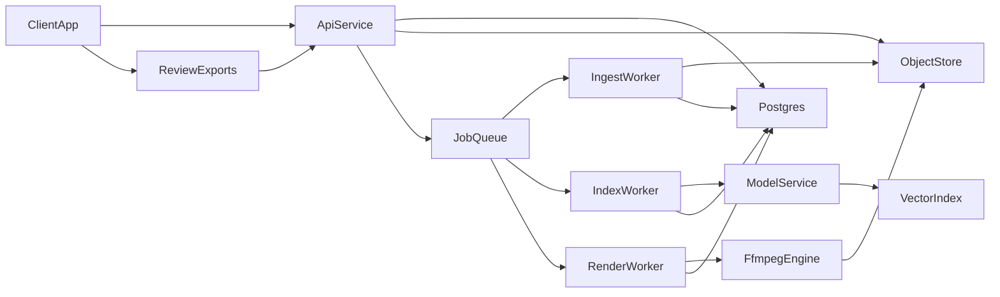

# Privacy-First Event Media Platform Plan

## Product Direction

This idea is strong. The clearest wedge is not "AI video generation" but "AI-assisted event storytelling from your existing media library," with privacy and predictable outputs as the core differentiators.

Recommended positioning:

- Private media intelligence for photographers and families
- Open-weight, self-hostable processing only
- Deterministic output generation using selection, sequencing, trimming, transitions, subtitles, and music sync rather than altering source media

## Pitch-First Goal

The next step should be a private-repo pitch package, not implementation-heavy architecture work. The pitch should answer:

- Is this feasible with private, open-weight models only?
- Which multimodal model stack should be used first?
- What hardware envelope is needed for a credible MVP and early pilots?
- Which tools and frameworks make the first version practical?
- What is realistic in v1 versus aspirational?

## Recommended `pitch/` Files

Create these first after plan approval:

- [pitch/overview.md](/home/skyguy/foss/videowala/pitch/overview.md): problem, user, USP, and why now
- [pitch/feasibility.md](/home/skyguy/foss/videowala/pitch/feasibility.md): what can be built today with open weights, known constraints, and MVP boundaries
- [pitch/model-stack.md](/home/skyguy/foss/videowala/pitch/model-stack.md): recommended model choices, alternatives, and rationale
- [pitch/system-sizing.md](/home/skyguy/foss/videowala/pitch/system-sizing.md): GPU/CPU/RAM/storage envelopes for dev, pilot, and early production
- [pitch/tech-stack.md](/home/skyguy/foss/videowala/pitch/tech-stack.md): frameworks, tools, and infrastructure choices
- [pitch/roadmap.md](/home/skyguy/foss/videowala/pitch/roadmap.md): MVP-to-pilot sequence with explicit non-goals
- [pitch/risks.md](/home/skyguy/foss/videowala/pitch/risks.md): quality, cost, privacy, and operational risks with mitigations

Every pitch file should include a short section on privacy posture and explicitly state that source media is never sent to third-party model APIs.

## Feasibility Assessment

This is feasible if you frame the product correctly:

- Feasible now: media ingest, thumbnails/proxies, captions, tags, face clustering, OCR, speech-to-text, semantic retrieval, shot ranking, timeline generation, and deterministic renders with `ffmpeg`
- Feasible with strong heuristics: person-focused reels, chronological highlight films, event summaries, reusable templates, and first-cut edit plans
- Not a v1 goal: fully autonomous cinematic taste, deep emotional narrative understanding, or real-time indexing of very large libraries on modest hardware

The core feasibility insight is that you do not need one magical multimodal model to do everything. A practical private stack is compositional:

- One multimodal model for image/video understanding
- One embedding model for retrieval
- Specialized tools for faces, OCR, and speech
- Deterministic media assembly via `ffmpeg`

## Recommended Model Stack

Recommended MVP stack:

- Primary VLM: `Qwen2.5-VL-7B-Instruct`
- Dev/low-cost fallback: `Qwen2.5-VL-3B`
- Higher-quality evaluation candidate: `Molmo2-8B`
- Embeddings: `SigLIP2` base or NaFlex variant
- Face detection/recognition: `InsightFace`-class stack
- OCR: `PaddleOCR`
- Speech-to-text: `faster-whisper` with `large-v3-turbo`

Why this stack:

- `Qwen2.5-VL` is a practical first choice because it is open-weight, handles both images and videos, supports long-video reasoning, and has a more established deployment ecosystem.
- `Molmo2-8B` looks very strong for video understanding and should stay in the evaluation track, but it is better treated as an upgrade candidate than the default MVP dependency.
- `SigLIP2` is a strong open embedding choice for semantic retrieval and multilingual matching.
- `InsightFace`, `PaddleOCR`, and `faster-whisper` are each proven in their niche and reduce pressure on the main VLM.

## System Sizing Guidance

Use rough sizing tiers in the pitch rather than pretending precision you do not yet have:

- Dev workstation: 1 GPU with 12 GB VRAM, 32 GB RAM, fast NVMe. Good for photos, short-video sampling, and slower async tests.
- Pilot deployment: 1 GPU with 24 GB VRAM, 64-128 GB RAM, large NVMe scratch space, and separate object storage. Good for small studios and a few concurrent jobs.
- Early production: dedicated API/database nodes plus isolated GPU workers and object storage; size workers by concurrent indexing and rendering demand rather than by tenant count alone.

Operational guidance to include:

- Video indexing cost is dominated by frame sampling and proxy generation, not just model inference.
- Speech-to-text is comparatively cheap; `faster-whisper` is not the main bottleneck.
- Full-resolution video analysis is unnecessary for most retrieval and edit-planning tasks; proxy + sampled frames is the practical path.
- Rendering scales separately from indexing and should run in isolated worker queues.

## Lightweight Architecture

Keep architecture present, but secondary to feasibility:

- Backend: Python `FastAPI`
- Worker layer: Python background workers with a queue
- Database: `PostgreSQL`
- Search/indexing: `pgvector` first
- Object storage: S3-compatible storage such as `MinIO`
- Media processing: `ffmpeg` and `ffprobe`
- Frontend: `Next.js` or another lightweight React app
- Model serving: local GPU workers hosting open-weight models only

## Tech Stack Recommendation

Keep the implementation stack simple and Python-first:

- Backend/API: Python `FastAPI`
- Workers: `Dramatiq` or `RQ` with `Redis`
- Database: `PostgreSQL`
- Vector retrieval: `pgvector`
- Object storage: `MinIO`
- Media tooling: `ffmpeg`, `ffprobe`, `PySceneDetect`
- Frontend: `Next.js`

Why these choices:

- `pgvector` is simpler than starting with a separate vector database such as `Qdrant`.
- `ffmpeg` should be the primary renderer and trimmer; higher-level wrappers are optional helpers, not foundational dependencies.
- A Python-first pipeline reduces operational and developer complexity because most AI/media tasks will already live there.

## Multi-Tenant Privacy Requirements

Because you chose hosted multi-tenant, privacy design needs explicit boundaries:

- Per-tenant logical isolation in PostgreSQL and object storage prefixes/buckets
- Per-tenant encryption keys if feasible
- No cross-tenant model context, caches, or retrieval indexes
- GPU workers must process tenant jobs without retaining media in shared scratch space after completion
- Strong audit logs for upload, indexing, search, and render actions
- Clear data retention and deletion workflows

## Technical Risks To Plan Around

- Video indexing cost will dominate; you will need frame sampling and proxy workflows rather than full-fidelity analysis everywhere.
- Face recognition across large event libraries can become legally and operationally sensitive; make it opt-in and tenant-scoped.
- "Great edit taste" is harder than media understanding; start with transparent heuristics plus ranking instead of fully autonomous cinematic decisions.
- Multi-tenant privacy increases operational burden significantly; isolate job artifacts and caches from day one.

## Recommended MVP Scope

Focus MVP on one strong workflow:

- Input: event upload with context + important people reference images
- Understanding: captions, tags, faces, embeddings, OCR, quality signals
- Request types: `highlight_reel`, `chronological_film`, `person_focus_reel`
- Output: preview timeline and final rendered MP4
- Human control: allow users to pin/exclude shots and regenerate from the same asset pool

Avoid in MVP:

- Free-form generative video edits
- Live collaborative editing
- Complex template marketplace
- Full mobile apps
- Real-time upload-from-camera integrations

## Build Sequence

1. Create the `pitch/` documents with feasibility, model choices, system sizing, stack decisions, and risks.
2. Write down concrete resource envelopes and benchmark assumptions for photos, sampled video frames, OCR, faces, and transcription.
3. Finalize the MVP model/tool stack and clearly separate primary picks from fallback options.
4. Only then sketch lightweight architecture and repo scaffolding needed to support the pitch and eventual implementation.
5. After pitch approval, bootstrap the actual repo around ingest, indexing, planning, and rendering.

## Recommendation

This is worth pursuing if the pitch stays disciplined: "We can privately ingest event media, understand it with open-weight models, and generate a good first-cut reel or film faster than manual editing." That claim is credible today, especially if the pitch is explicit that cinematic quality comes from strong selection heuristics and human review, not from magical end-to-end AI editing.
