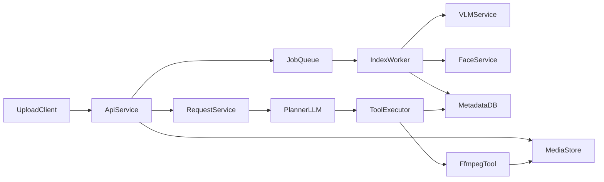

# MVP Implementation Plan (VLM + Face + Planner LLM)

## Scope Lock

Implement the product defined in `[/home/skyguy/foss/videowala/pitch/feasibility.md](/home/skyguy/foss/videowala/pitch/feasibility.md)`, `[/home/skyguy/foss/videowala/pitch/model-stack.md](/home/skyguy/foss/videowala/pitch/model-stack.md)`, and `[/home/skyguy/foss/videowala/pitch/tech-stack.md](/home/skyguy/foss/videowala/pitch/tech-stack.md)` with these MVP constraints:

- Stage 1 (MVP): VLM indexing, face detection/recognition, request-to-edit planning, deterministic media assembly.
- Stage 2 (post-MVP): OCR, speech detection/transcription (ASR), semantic embedding retrieval.
- Keep model hosting local/private only in all stages.

## Model Stack For This MVP (12 GB target)

- **VLM**: `HuggingFaceTB/SmolVLM2-2.2B-Instruct` (already prototyped in `[/home/skyguy/foss/videowala/tools/vl_cli.py](/home/skyguy/foss/videowala/tools/vl_cli.py)`).
- **Face model**: InsightFace (detection + embeddings + tenant/event-scoped matching).
- **Planner/orchestrator model**: small local text LLM (e.g., Llama-3.2-3B-Instruct class) that outputs constrained JSON tool calls.

## Architecture For MVP

## Implementation Phases

### Phase 1: Foundation And Data Contracts

- Create backend service skeleton (API + workers + job queue) aligned with existing docs.
- Define core entities/tables for tenant, event, person, asset, asset_insight, edit_plan, render_job (from `[/home/skyguy/foss/videowala/docs/data-model.md](/home/skyguy/foss/videowala/docs/data-model.md)`).
- Add explicit MVP insight types: `vlm_caption`, `vlm_tags`, `face_detections`, `face_matches`.
- Add feature flags and extension points so OCR/ASR/embedding modules can be enabled in Stage 2 without schema rewrites.

### Phase 2: Ingestion + Indexing (VLM and Face Only)

- Implement upload endpoints and media manifest persistence.
- Build indexing worker pipeline:
  - extract media metadata (`ffprobe`)
  - generate thumbnails/proxies
  - run SmolVLM on sampled frames/clips
  - run face detection/embedding and event-scoped matching
- Persist structured timeline/context artifacts per asset for downstream planning.

### Phase 3: Planner LLM + Tool Calling

- Implement request endpoint accepting user brief + event context.
- Add planner prompt template that receives:
  - event metadata
  - VLM summaries/tags
  - face match timeline/context
- Constrain planner outputs to strict JSON schema (no free text execution), e.g.:
  - `select_segments`
  - `set_order`
  - `set_duration`
  - `render_preview`
- Build server-side tool executor that validates planner JSON before running `ffmpeg` actions.

### Phase 4: Rendering + Review Loop

- Implement deterministic render pipeline from validated edit plan.
- Store preview/final artifacts and job state transitions.
- Add simple feedback controls: include/exclude segments and regenerate plan.

### Phase 5: MVP Hardening

- Add tenant isolation checks across storage, metadata, and worker scratch files.
- Add audit trail for upload, indexing, planning, and rendering actions.
- Add baseline tests:
  - indexing pipeline with sample media in `[/home/skyguy/foss/videowala/test/media](/home/skyguy/foss/videowala/test/media)`
  - planner JSON validation tests
  - render command safety tests

## Concrete File/Folder Targets

- Existing to update:
  - `[/home/skyguy/foss/videowala/pitch/model-stack.md](/home/skyguy/foss/videowala/pitch/model-stack.md)`
  - `[/home/skyguy/foss/videowala/pitch/feasibility.md](/home/skyguy/foss/videowala/pitch/feasibility.md)`
  - `[/home/skyguy/foss/videowala/pitch/tech-stack.md](/home/skyguy/foss/videowala/pitch/tech-stack.md)`
  - `[/home/skyguy/foss/videowala/pitch/roadmap.md](/home/skyguy/foss/videowala/pitch/roadmap.md)`
- New implementation structure:
  - `/home/skyguy/foss/videowala/backend/app/main.py`
  - `/home/skyguy/foss/videowala/backend/app/api/`
  - `/home/skyguy/foss/videowala/backend/app/services/ingest.py`
  - `/home/skyguy/foss/videowala/backend/app/services/indexing.py`
  - `/home/skyguy/foss/videowala/backend/app/services/planner.py`
  - `/home/skyguy/foss/videowala/backend/app/services/rendering.py`
  - `/home/skyguy/foss/videowala/backend/app/workers/`
  - `/home/skyguy/foss/videowala/backend/tests/`
  - `/home/skyguy/foss/videowala/infra/docker-compose.yml`

## Acceptance Criteria For MVP

- Event upload + indexing produces VLM context and face context in Stage 1, with schema and service hooks ready for Stage 2 OCR/ASR/embedding.
- User brief produces a validated JSON edit plan from the planner LLM.
- Tool executor converts the plan to deterministic `ffmpeg` actions and generates preview output.
- Users can modify selection (include/exclude) and regenerate.
- All media stays local/private and tenant scoped.

## Stage 2 Backlog (Deferred, Not Removed)

- OCR indexing for text-rich frames and signage.
- ASR/transcription for spoken context from video audio.
- Semantic embedding retrieval for natural-language search and better shot recall.
- Planner prompt upgrades to consume OCR, ASR, and embedding-derived context once enabled.
