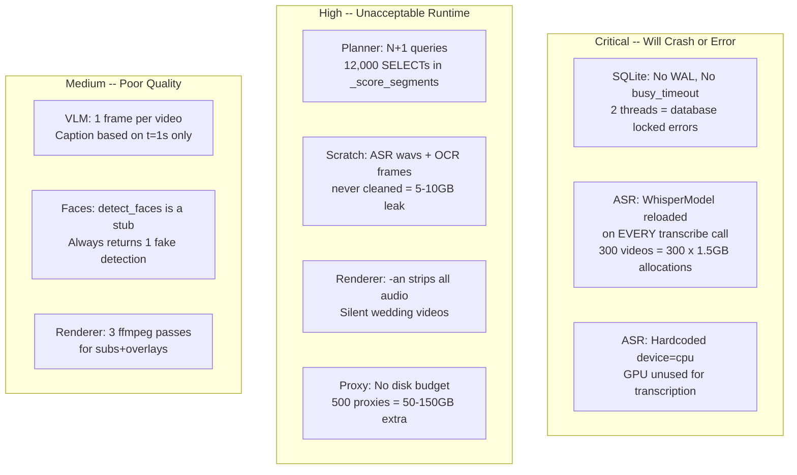

# Scale Readiness: 20-30GB Media Dataset

## Current Assessment

The pipeline structure (proxy -> segment -> cull -> index -> plan -> render) is correct. But the internals have 3 critical issues that will cause outright failures, plus several high-severity issues that would make a 500-file wedding dataset take 8+ hours instead of 2-3.



---

## Fix 1 (Critical): SQLite WAL Mode + Busy Timeout

The async workers (2 threads) plus FastAPI's main thread all open/close fresh SQLite connections. Without WAL mode, any concurrent write causes `database is locked`. Without `busy_timeout`, these errors are immediate (0ms retry).

In [backend/app/db.py](backend/app/db.py), `get_connection()` (line 23) needs:

```python
conn.execute("PRAGMA journal_mode=WAL")
conn.execute("PRAGMA busy_timeout = 5000")
```

This is a 2-line fix that prevents the most common crash scenario at scale.

## Fix 2 (Critical): Cache the ASR Whisper Model

In [backend/app/services/asr.py](backend/app/services/asr.py), line 69, `WhisperModel("large-v3-turbo")` is instantiated as a **local variable inside `transcribe()`**. Every call allocates ~1.5GB, transcribes, then waits for GC. For 300 videos this wastes ~50 minutes on model loading alone and risks OOM.

Fix: move the model to an instance attribute with a load-once pattern (same as VLM and OCR already use). Also switch from `device="cpu"` to auto-detect GPU when available.

## Fix 3 (Critical): Whisper Should Use GPU When Available

Same file, line 69: `device="cpu"` is hardcoded. The GPU sits idle during transcription. On a single RTX card, GPU Whisper is 3-5x faster than CPU int8. Change to:

```python
device = "cuda" if torch.cuda.is_available() else "cpu"
compute_type = "float16" if device == "cuda" else "int8"
```

## Fix 4 (High): Eliminate N+1 Queries in Planner

In [backend/app/services/planner.py](backend/app/services/planner.py), `_score_segments()` calls `AssetRepository.get(seg.asset_id)` inside a loop over every segment. With 40 segments per video x 300 videos = 12,000 individual SELECT queries, each opening/closing a SQLite connection.

Fix: load all event assets once upfront via `AssetRepository.list_for_event()`, build a dict, and look up from that. Same fix for `SegmentRepository.update_culling` -- batch the updates into a single transaction.

## Fix 5 (High): Clean Up Scratch Files

Three locations accumulate files that are never deleted:

- [backend/app/services/asr.py](backend/app/services/asr.py) line 66: WAV files at `scratch_root/asr/` (~10MB per video, ~3GB for 300 videos)
- [backend/app/services/ocr.py](backend/app/services/ocr.py) line 140: Frame JPEGs at `scratch_root/ocr/{stem}/` (~1-3MB per video)
- VLM frame at `scratch_root/vlm/` (minor)

Fix: delete extracted files after processing in each service, or add a post-index cleanup step.

## Fix 6 (High): Preserve Audio in Renders

In [backend/app/services/rendering.py](backend/app/services/rendering.py), every clip preparation function uses `-an` (strip audio). Wedding videos without audio are not useful even for MVP demos. The renderer should carry audio through at least for video clips, and mix it into the final concat.

This means removing `-an` from `_prepare_video_clip_range` and the concat command, and adding `-c:a aac` to the output.

## Fix 7 (High): Proxy Disk Budget + Cleanup

In [backend/app/services/ingest.py](backend/app/services/ingest.py), proxy files are written to `storage/{tenant}/{event}/proxies/` with no size check. For 300 wedding videos, proxies at 960px/12fps/crf27 can be 50-150GB -- potentially larger than the source media.

Fix: add a disk-space check before proxy generation, and provide an API/CLI to purge proxies after indexing completes (since they are only needed during analysis, not rendering).

## Fix 8 (Medium): Multi-Frame VLM Sampling for Video

In [backend/app/services/vlm.py](backend/app/services/vlm.py), line 134-136, only a single frame at `t=1.0s` is extracted for video understanding. A 5-minute reception speech is captioned from its first second.

Fix: extract 3-5 frames (similar to OCR sampling strategy) and either caption the best one or combine captions. This directly improves cull scoring and planner relevance -- the entire downstream quality depends on it.

## Fix 9 (Medium): Combine Subtitle + Overlay Into Single FFmpeg Pass

In [backend/app/services/rendering.py](backend/app/services/rendering.py), lines 436-450, if both subtitles and overlays are enabled, the final video is re-encoded **three times** (base -> subtitles -> overlays). These filter chains can be combined into a single ffmpeg invocation.

## Not Recommended for This Phase

- Connection pooling (SQLite WAL + busy_timeout is sufficient for single-node)
- Postgres connection pooling (low-frequency vector upserts)
- Real face detection (InsightFace) -- the stub is fine for PoC
- Increasing worker pool beyond 2 (GPU contention is the real limit)
- Planner cap increases (30 assets / 80 segments is fine for MVP renders)

## Expected Impact

| Metric | Before fixes | After fixes |
| ------ | ------------ | ----------- |
| 500-file indexing (GPU) | ~8 hours, likely crashes | ~2-3 hours, stable |
| SQLite under concurrency | database locked errors | Reliable |
| Scratch disk after indexing | 5-10GB leaked | Cleaned |
| ASR time per video | ~30s (10s load + 20s transcribe) | ~12s (cached model, GPU) |
| Render audio | Silent | Audio preserved |
| VLM video quality | 1 frame, often irrelevant | 3-5 frames, representative |
