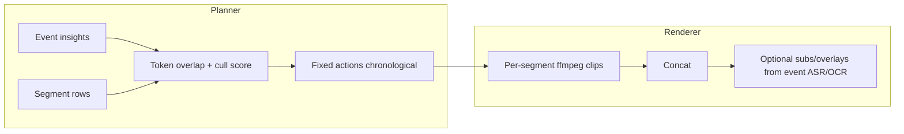

# Improving the planner and renderer

## Current behavior (reference)

**Planner** (`[backend/app/services/planner.py](backend/app/services/planner.py)`):

- Builds per-asset text from `vlm_caption`, `vlm_tags`, `ocr_text`, `asr_transcript`, `face_matches` via `[_build_asset_context](backend/app/services/planner.py)`.
- `[_score_segments](backend/app/services/planner.py)` combines segment `score` (from indexing cull) with **prompt token overlap**, optional **face** and **include_asset** bonuses, dedupes by `(media_type, path, start, end)`, marks `keep` with threshold `0.35`, and **fallback-keeps** top segments if fewer than 4 kept.
- `[build_plan](backend/app/services/planner.py)` dedupes assets, caps at 30 assets / 80 segment ids, backfills with `[semantic_search](backend/app/services/search.py)` if fewer than 12 assets, then always emits: `select_segments` → `set_order` with `**strategy: "chronological"`** → `set_duration` → `render_preview` → optional subtitle/overlay actions.
- `**output_type`** (`highlight_reel` | `chronological_film` | `person_focus_reel`) is stored on the plan but **does not change** scoring or `set_order` today.

**Renderer** (`[backend/app/services/rendering.py](backend/app/services/rendering.py)`):

- `[create_render_job](backend/app/services/rendering.py)` / `[execute_render_job](backend/app/services/rendering.py)`: builds `clip_inputs` from selected **segments** (path = **full source** `asset.media_path`, `start_s` from segment).
- `[_render_from_inputs](backend/app/services/rendering.py)`: `[_allocate_clip_seconds](backend/app/services/rendering.py)` splits total duration by **segment score**, `[_continuity_order](backend/app/services/rendering.py)` sorts by `(asset_id, start_s)` and swaps adjacent duplicate assets when possible; per clip: encode with `[TARGET_FILTER](backend/app/services/rendering.py)` (720p pad, 30fps), then **concat** demuxer.
- **Subtitles / overlays**: ASR and OCR are taken from **all** insights for the event (`[execute_render_job](backend/app/services/rendering.py)` loops `InsightRepository.list_for_event`), not time-aligned to the selected clips—fine for a single long transcript, weak for multi-asset montages.

---

## Planner: quality / relevance improvements

1. **Honor `output_type`** — Differentiate strategies without new models:

- *chronological_film*: order by `asset.created_at` / capture time if available (may need schema or manifest field), not only `(asset_id, start_s)`.
- *person_focus_reel*: rank/boost segments whose `face_matches` include `include_faces`, filter to those assets first.
- *highlight_reel*: emphasize diversity (avoid many segments from one asset), max clips per asset, or boost semantic match + pacing.

1. **Richer relevance than token overlap** — Today `[_tokenize](backend/app/services/planner.py)` + Jaccard-style ratio is brittle for paraphrases. Options: use the same **embedding model** as search to score each segment’s text against `request.prompt`, or hybrid (embedding + keyword).
2. **Tighter coupling to indexing** — Segment `score` already reflects VLM/cull; planner could add explicit use of **tags** (e.g. prompt mentions “speech” → boost ASR-heavy assets) or **negative prompts** (exclude tags).
3. **Plan actions that match capabilities** — e.g. `set_order` params could carry `primary_person_id` or `max_segments_per_asset`; `exclude_segments` is validated but **never emitted** by `build_plan`—could wire real exclusions from UI.
4. **Optional LLM planner (later)** — Small local LLM to map `ContentRequestCreate` + JSON context into actions; higher effort, only if rule-based limits are hit.

---

## Renderer: visual and editorial improvements

1. **Per-clip ASR/OCR (or time windows)** — For montages, burn subtitles / overlays derived only from **selected assets** and ideally **time ranges** `[start_s, end_s]` of each clip, instead of concatenating all event ASR/OCR (`[execute_render_job](backend/app/services/rendering.py)` ~503–513).
2. **Proxy sources for speed** — Indexing already builds video proxies; rendering could optionally use **proxy paths** from `[asset_proxies](backend/app/services/ingest.py)` for faster seeks/encode, then swap to full-res for final export if needed.
3. **Encoding and cadence** — Expose `preset`, `crf`, resolution (1080p), or **audio loudness** (`loudnorm`) via config or plan params instead of hardcoded `veryfast` + 720p.
4. **Transitions** — Simple **xfade** between clips in ffmpeg, or shortest crossfade, for less “slideshow” feel.
5. **Audio** — Optional background music track (ducked under speech), or strip silent gaps; requires new plan actions and rights-safe assets.
6. **Overlays** — Today `[drawtext](backend/app/services/rendering.py)` stacks fixed positions; could use OCR **bboxes** and scale to 720p frame for approximate placement (harder but more accurate).

---

## What to prioritize for a PoC

| Impact | Area | Change |
| ------ | ---- | ------ |
| High | Planner | Branch `set_order` / segment ranking by `output_type` + person-focus boosts |
| High | Renderer | Filter ASR/OCR to **selected assets** (and optionally segment time ranges) |
| Medium | Renderer | Configurable resolution/preset; optional xfade |
| Medium | Planner | Embedding-based prompt similarity instead of or blended with token overlap |
| Lower | Renderer | Music, advanced OCR placement |

No code changes in this step—this is a roadmap you can pick from for the next implementation pass.
