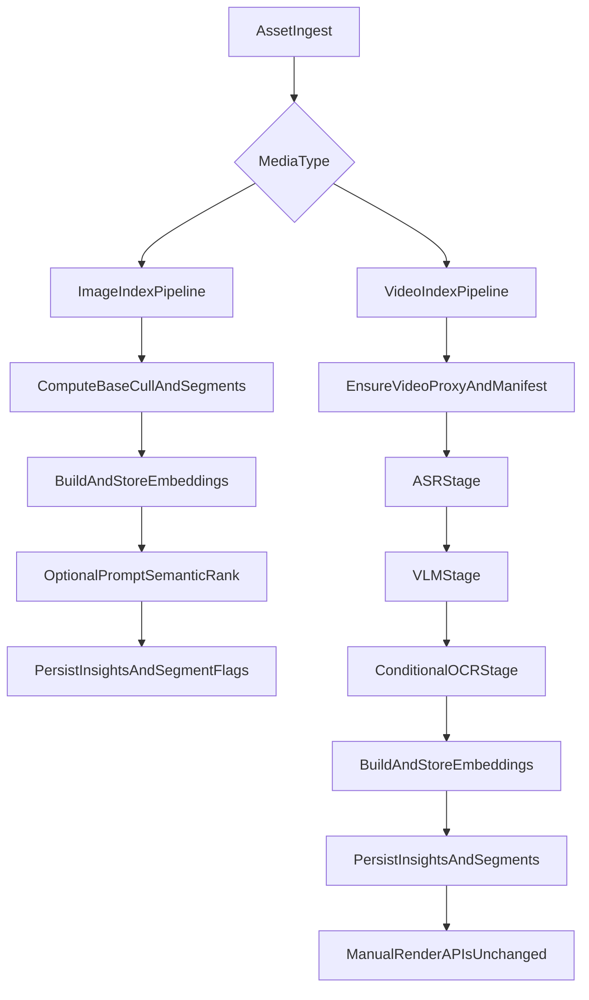

# Serial Image/Video Indexing Refactor Plan

## Objectives

- Replace the single mixed `index_asset` flow with two explicit pipelines:
  - **Image pipeline**: existing culling signals + prompt-aware semantic ranking path.
  - **Video pipeline**: index and persist rich insights/vector data, then leave rendering to existing manual render APIs.
- Enforce **serial execution and serial model lifecycle** for PoC quality focus:
  - One model family loaded at a time per asset step.
  - Explicit unload between heavyweight stages.
  - No concurrent index jobs.
- Keep GPU-first behavior (no DEV mode guidance), prioritize best model per task even with slower throughput.
- Treat this as a **PoC hard cutover**: no backward-compatibility preservation work, no dual-path migration, and no performance-first optimizations.

## Current Baseline To Refactor

- Unified orchestration is currently in [backend/app/services/indexing.py](backend/app/services/indexing.py) (`index_asset` branches only lightly by media type).
- Cross-asset parallelism is currently hardcoded at `max_workers=2` in [backend/app/workers/index_worker.py](backend/app/workers/index_worker.py).
- Prompt-semantic ranking for photos exists in [backend/app/services/photo_curation.py](backend/app/services/photo_curation.py), not in indexing orchestration.
- Rendering is already separate/manual in [backend/app/services/rendering.py](backend/app/services/rendering.py) and [backend/app/workers/index_worker.py](backend/app/workers/index_worker.py).

## Target Architecture

## Implementation Plan

### 1) Add Persistent PoC Rule

- Create a Cursor rule in `.cursor/rules/` stating:
  - This project is PoC-first.
  - Prioritize viability and output quality over backward compatibility and throughput.
  - Do not propose DEV mode for solving backend/GPU indexing issues.
  - Prefer direct replacement over compatibility shims when refactoring pipeline behavior.

### 2) Split Orchestration Into Explicit Pipelines

- In [backend/app/services/indexing.py](backend/app/services/indexing.py):
  - Introduce `index_image_asset(...)` and `index_video_asset(...)` as first-class entrypoints.
  - Keep shared helpers (event context, segment persistence, embedding text building) in internal utility functions.
  - Replace `index_asset(...)` call path with typed entrypoints directly (remove legacy mixed orchestration path).
- Preserve existing image culling behavior (`_base_cull_score`, segment signatures, reasons) while isolating image-specific flow.
- Keep video-specific stages (proxy/ASR/multi-frame VLM/OCR) in video pipeline only.

### 3) Enforce Serial Job Processing (No Parallel Index Jobs)

- In [backend/app/workers/index_worker.py](backend/app/workers/index_worker.py):
  - Change index executor from fixed `max_workers=2` to configurable setting with default `1`.
  - Add an explicit settings-backed `INDEX_WORKERS` (default `1`) in [backend/app/config.py](backend/app/config.py).
  - Ensure all index submissions use this single-worker executor.
- Keep render executor behavior unchanged (manual render trigger remains explicit).

### 4) Add Explicit Model Lifecycle Hooks (Load -> Use -> Unload)

- For each heavy service, add `release()` / `unload()` methods:
  - [backend/app/services/vlm.py](backend/app/services/vlm.py)
  - [backend/app/services/asr.py](backend/app/services/asr.py)
  - [backend/app/services/embeddings.py](backend/app/services/embeddings.py)
  - [backend/app/services/ocr.py](backend/app/services/ocr.py) (clear per-language cached instances)
  - [backend/app/services/faces.py](backend/app/services/faces.py) (if real recognizer active)
- In each `release()`:
  - Drop model references (`None` / clear dict caches).
  - Trigger Python GC and best-effort GPU memory reclaim (`torch.cuda.empty_cache()` guarded by availability).
- In new image/video pipelines, enforce stage order with explicit teardown between model families:
  - Example video order: `faces -> release -> asr -> release -> vlm -> release -> ocr -> release -> embeddings -> release`.
- Add a small reusable helper in indexing layer for safe stage wrappers (loads model lazily, runs stage, always releases in `finally`).

### 5) Image Prompt-Semantic Ranking Integration (Support Both Ingest-Time and Query-Time)

- Keep existing query-time ranking behavior in [backend/app/services/photo_curation.py](backend/app/services/photo_curation.py).
- Add optional ingest-time prompt ranking path:
  - Extend ingest/index request model in [backend/app/api/routes.py](backend/app/api/routes.py) (and corresponding schema) to accept optional `semantic_prompt`.
  - Persist optional prompt in index job metadata (repository/model updates in [backend/app/repositories.py](backend/app/repositories.py) and related models if needed).
  - If prompt exists during image indexing, run semantic scoring post-embedding and update segment keep/score using same ranking semantics as `score_photo_segments`.
- Behavior rule:
  - If no prompt at ingest, image pipeline indexes normally and later curation/query can rank by prompt.

### 6) Video Pipeline Persistence and Manual Render Contract

- Ensure video indexing always persists:
  - proxy/manifests,
  - ASR/VLM/OCR insights,
  - embeddings/vectors,
  - segment rows.
- Keep render path manual-only:
  - No auto `submit_render_job` from indexing completion.
  - Update API docs to clearly state “index first, then explicit render request.”

### 7) Tune Item Processing Granularity (From Current 2, Model-Capability-Aware)

- Replace hardcoded throughput assumptions with settings for PoC tuning (quality first):
  - `INDEX_WORKERS` (default 1)
  - optional per-stage micro-batch knobs where meaningful (e.g., VLM frame sample count cap, photo curation candidate count), with conservative defaults.
- Keep defaults strictly serial and quality-oriented; expose knobs only for controlled experimentation.

### 8) Schema/Repo/Docs/Test Updates

- Update docs for true behavior in:
  - [docs/api.md](docs/api.md)
  - [docs/architecture.md](docs/architecture.md)
  - [docs/running.md](docs/running.md)
- Add/adjust tests:
  - [backend/tests/test_indexing.py](backend/tests/test_indexing.py): split image/video pipeline tests; verify ordered stage invocation and persistence.
  - New tests around serial executor behavior in worker layer.
  - Photo ranking tests for ingest-time prompt path plus existing query-time path compatibility.
- Validate core behavior under direct-cutover assumptions (no compatibility validation matrix needed).

## Acceptance Criteria

- Image and video indexing execute via different pipeline entrypoints with no mixed media branching inside stage implementations.
- Index worker pool runs with one worker by default; no concurrent index jobs.
- Heavy models are explicitly released between stages; logs/metrics confirm serial load/unload progression.
- Image semantic ranking supports:
  - ingest-time prompt (immediate ranking), and
  - query-time prompt (existing curation path).
- Video indexing completion does not auto-trigger rendering; manual render APIs remain the only trigger.
- Planner/search consume the new pipeline outputs without compatibility shims.

## Risks & Mitigations

- **Risk:** Frequent load/unload increases latency and initialization failures.
  - **Mitigation:** robust retry around model init, stage-level error handling, and clear failure metadata per stage.
- **Risk:** Divergence between ingest-time and query-time photo ranking logic.
  - **Mitigation:** centralize shared ranking function used by both indexing and curation paths.
- **Risk:** GPU memory fragmentation during repeated model swaps.
  - **Mitigation:** strict release order, guarded cache clearing, and optional lightweight health checks before each stage.

## Rollout Strategy

- Phase 1: Add PoC Cursor rule and implement split pipelines + serial worker config (default 1) as the default path.
- Phase 2: Add explicit model release methods and stage wrappers; soak test on mixed asset set.
- Phase 3: Enable ingest-time optional prompt ranking for images; keep query-time path intact.
- Phase 4: Update docs/tests and remove deprecated unified orchestration paths immediately as part of cutover.
