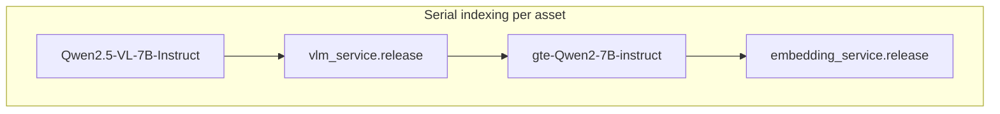

# VLM and embedding stack (locked models)

## Locked choices (no fallback models)

| Role | Hugging Face id | Notes |
| ---- | --------------- | ----- |
| **VLM** | `[Qwen/Qwen2.5-VL-7B-Instruct](https://huggingface.co/Qwen/Qwen2.5-VL-7B-Instruct)` | Replace current SmolVLM2 path in `[backend/app/services/vlm.py](backend/app/services/vlm.py)`. Use official Qwen2.5-VL inference patterns (processor, chat template, `generate`). Keep the product JSON contract: caption, tags, caption_confidence. |
| **Embeddings** | `[Alibaba-NLP/gte-Qwen2-7B-instruct](https://huggingface.co/Alibaba-NLP/gte-Qwen2-7B-instruct)` | Replace `BAAI/bge-m3` in `[backend/app/services/embeddings.py](backend/app/services/embeddings.py)`. Set `**EMBEDDING_VECTOR_DIM`** to the model’s **native dense dimension (3584)** per the model card; `[migrate_pgvector()](backend/app/vector_store.py)` will rebuild `asset_vectors` when dim changes—plan a **full re-embed** after cutover. |

**OCR / ASR:** unchanged (PaddleOCR + faster-whisper).

## Hardware (unchanged rationale)

With **serial** indexing and `**release()`** between stages, **peak VRAM is one model at a time**. A **7B VLM** and a **7B embedding model** each fit **16GB** in isolation for inference, but **video** (multi-frame, large tensors) can still spike usage—validate and, if needed, **tune inputs** (frame count, resolution, max_new_tokens), not swap models.

## Implementation focus

1. **VLM:** Remove reliance on SmolVLM-specific `AutoProcessor` / `AutoModelForVision2Seq` assumptions; implement Qwen2.5-VL loading and decoding; keep `[indexing.py](backend/app/services/indexing.py)` calling `vlm_service.caption_and_tags` with the same outer contract.
2. **Embeddings:** `gte-Qwen2-7B-instruct` may need a **dedicated loading path** (not identical to generic `SentenceTransformer(bge-m3)`). Confirm whether `**sentence-transformers`** supports this checkpoint or use **transformers + pooling** per Alibaba’s usage; normalize vectors as today for cosine search.
3. **pgvector:** Update `[EMBEDDING_VECTOR_DIM](backend/app/config.py)` default to **3584**; run migration awareness (table rebuild on startup when dim changes).

## References in-repo

- `[backend/app/config.py](backend/app/config.py)` — `VLM_MODEL_ID`, `EMBEDDING_MODEL_ID`, `EMBEDDING_VECTOR_DIM`
- `[backend/app/services/vlm.py](backend/app/services/vlm.py)`
- `[backend/app/services/embeddings.py](backend/app/services/embeddings.py)`
- `[backend/app/vector_store.py](backend/app/vector_store.py)`
- `[docs/pitch/model-stack.md](docs/pitch/model-stack.md)` — update stale embedding line when defaults change
