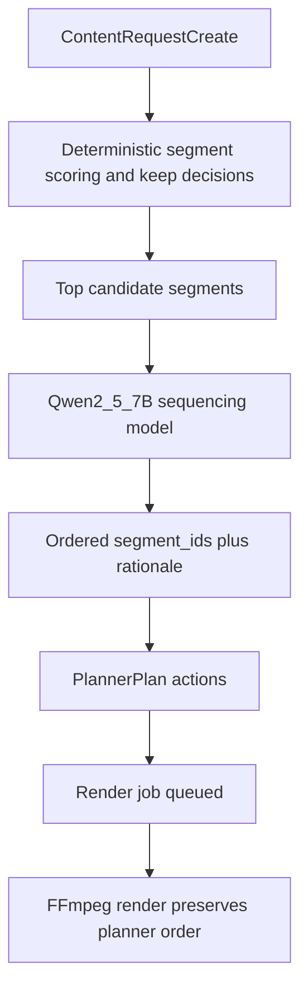

# Model-Assisted Planning for Shot Continuity

## Goal

Add a dedicated model stage in planning that takes the already-selected segments and returns an improved playback order (grouping contiguous cuts by source when appropriate) while preserving current deterministic selection/culling.

## Implementation Approach

- Keep current pipeline split: **selection/scoring stays deterministic** in `[/home/skyguy/foss/videowala/backend/app/services/planner.py](/home/skyguy/foss/videowala/backend/app/services/planner.py)`.
- Add a **second pass sequencer model** for ordering only (auto-picked option): `Qwen/Qwen2.5-7B-Instruct` with structured JSON output.
- Keep render deterministic in `[/home/skyguy/foss/videowala/backend/app/services/rendering.py](/home/skyguy/foss/videowala/backend/app/services/rendering.py)`; it will consume planner-provided segment order via existing `set_order=preserve_planner` behavior.

## Planned Code Changes

- Add planner-model config knobs in `[/home/skyguy/foss/videowala/backend/app/config.py](/home/skyguy/foss/videowala/backend/app/config.py)`:
  - `PLANNER_MODEL_ID` (default `Qwen/Qwen2.5-7B-Instruct`)
  - `PLANNER_MAX_SEGMENTS` (cap candidate size to control latency/VRAM)
  - `PLANNER_TEMPERATURE` and `PLANNER_MAX_NEW_TOKENS`
- Add a new service (e.g. `[/home/skyguy/foss/videowala/backend/app/services/plan_sequencer.py](/home/skyguy/foss/videowala/backend/app/services/plan_sequencer.py)`):
  - Lazy-load tokenizer/model on GPU
  - Build compact segment context (asset id, start/end, score, topical cues)
  - Prompt for strict JSON: ordered `segment_ids` + short rationale
  - Validate output and ensure it is a permutation/subset of candidate IDs
  - Release model after use (PoC serial GPU discipline)
- Integrate sequencer into planner flow in `[/home/skyguy/foss/videowala/backend/app/services/planner.py](/home/skyguy/foss/videowala/backend/app/services/planner.py)`:
  - After `_score_segments` and before plan action assembly
  - Replace `ranked_segment_ids` ordering with model output
  - Set order strategy to `preserve_planner` for model-sequenced plans
  - Include model rationale in plan rationale string for traceability
- Ensure dependencies/support in `[/home/skyguy/foss/videowala/backend/requirements.txt](/home/skyguy/foss/videowala/backend/requirements.txt)` (transformers stack already present; only add if a missing runtime package is required).
- Document behavior in `[/home/skyguy/foss/videowala/docs/api.md](/home/skyguy/foss/videowala/docs/api.md)` and `[/home/skyguy/foss/videowala/docs/architecture.md](/home/skyguy/foss/videowala/docs/architecture.md)`: deterministic segment selection + model-assisted ordering.

## Validation and Tests

- Extend planner tests in `[/home/skyguy/foss/videowala/backend/tests/test_planner_schema.py](/home/skyguy/foss/videowala/backend/tests/test_planner_schema.py)` and/or add focused sequencer tests:
  - Model output keeps contiguous segments grouped when appropriate
  - Output IDs are valid, deduped, and length-bounded
  - Planner still emits required actions (`select_segments`, `render_preview`)
  - Failure path is explicit (invalid model JSON -> clear planning error)
- Run targeted backend tests for planning/render request flow.

## Data Flow

## Acceptance Criteria

- Plan ordering is no longer purely chronological/ranked for model-enabled requests.
- In cases like `A1, B1, A2, B2`, planner can output continuity-aware order (e.g. `A1, A2, B1, B2`) when narrative prompt supports it.
- Render output uses this planner sequence without introducing additional model steps during rendering.
