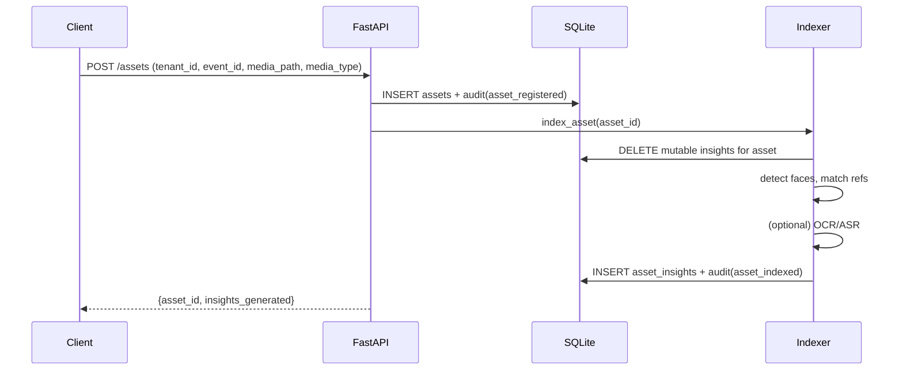
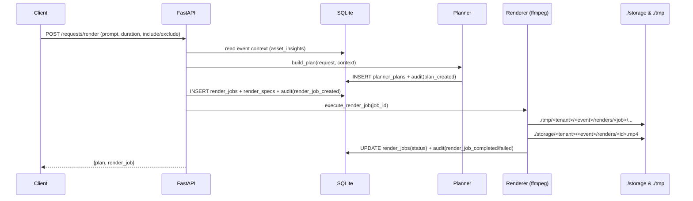

# Architecture (current codebase)

**What VideoWala is for:** see the root [`README.md`](../README.md). This page only describes how this repo is wired today (`backend/` + `frontend/`).

## What exists today

- **Backend**: FastAPI app (`backend/app/main.py`) exposing a small, tenant-scoped API.
- **Persistence**: SQLite (`./storage/videowala.db` at repo root by default) with auto-migrate on startup.
- **Storage**:
  - Source media is referenced by **path** (`assets.media_path`) and is expected to exist on the backend host.
  - Render outputs go to `./storage/<tenant_id>/<event_id>/renders/*.mp4` (repo root).
  - Scratch work uses `./tmp/<tenant_id>/<event_id>/...` (repo root) and is cleaned up after renders.
- **Indexing**:
  - Runs synchronously today (API calls `run_index_job()` inline).
  - Produces `asset_insights` rows (caption/tags + face detections/matches, OCR/ASR text, and semantic embedding metadata).
- **Planning**: Deterministic “planner skeleton” that returns a strict action list (`PlannerPlan`).
- **Rendering**: Deterministic ffmpeg pipeline (prepare per-asset clips → concat → optional subtitles/overlays).
- **OCR, ASR, semantic embeddings**: invoked as part of indexing; OCR/ASR run against media, and semantic vectors are written to **Postgres + pgvector** when available (best-effort if Postgres is unavailable).

## System diagram

```mermaid
flowchart LR
  UI[Frontend (Vite + React)] -->|HTTP JSON| API[FastAPI API]

  API -->|persist| SQLITE[(SQLite\n./storage/videowala.db)]
  API -->|read/write| FS[(Filesystem\nstorage/ + tmp/)]

  API -->|index asset (sync)| INDEX[Indexing pipeline]
  INDEX -->|write insights| SQLITE

  API -->|build plan| PLANNER[Planner (deterministic)]
  PLANNER -->|store plan| SQLITE

  API -->|render (sync)| RENDER[Rendering (ffmpeg)]
  RENDER --> FS
  RENDER -->|audit| SQLITE

  INDEX -. stage2 semantic .-> PG[(Postgres + pgvector)]
  INDEX -. stage2 OCR/ASR .-> INDEX
  API -. semantic search .-> PG
```

## Main request flows

### Ingest + Index

`POST /assets` registers an asset row, then indexes it immediately.



### Plan → Render

`POST /requests/render` builds a plan, creates a render job, then executes it synchronously.



## Tenancy + privacy boundaries (current)

- **Tenant scope** is enforced at the API layer via `assert_tenant_scope(...)` checks on event/person operations.
- **Audit**: key actions write to `audit_logs` in SQLite.
- **Media locality**: media is never uploaded via the API yet; the backend reads from local paths.
- **Scratch hygiene**: render scratch directories are deleted after job completion; explicit cleanup endpoint exists (`POST /events/{event_id}/cleanup`).

## Not implemented (yet) but referenced in pitch docs

- Asynchronous job queue (index/render are synchronous right now).
- Object storage abstraction (paths on local disk only).
- Multi-step clip selection / transitions / soundtracks (planner schema exists; renderer is intentionally minimal).
