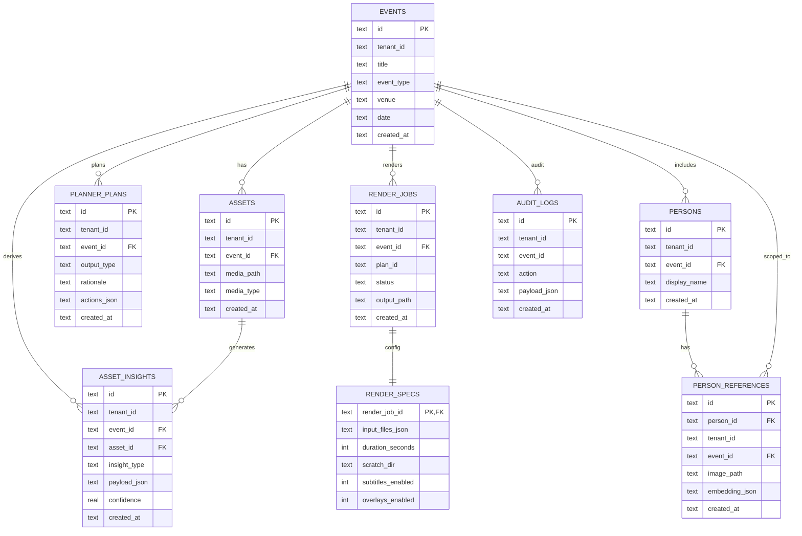

# Data model (current SQLite schema)

**Product context:** root [`README.md`](../README.md). This page is the **implemented** SQLite layer (`backend/app/db.py`).

## High-level ER diagram

## Notes and invariants

- **Tenant scope**: Most rows carry `tenant_id` for application-level checks; SQLite foreign keys enforce event/asset/person referential integrity.
- **Media**: `assets.media_path` is a path on disk; the backend does not currently ingest bytes into object storage.
- **Insights**: `asset_insights.payload_json` stores structured outputs for:
  - stage1: `vlm_caption`, `vlm_tags`, `face_detections`, `face_matches`
  - stage2 (optional): `ocr_text`, `asr_transcript`, `semantic_embedding`
- **Plans**: `planner_plans.actions_json` stores the ordered list of planner actions.
- **Renders**:
  - `render_jobs` is the user-visible job record.
  - `render_specs` stores deterministic inputs + feature flags for restart-safety.

## Out of scope (not persisted yet)

- Users/accounts (beyond `tenant_id` as a string).
- Upload sessions and object storage metadata.
- Fine-grained segments/timeline primitives (only “asset_ids → simple preview render” today).
