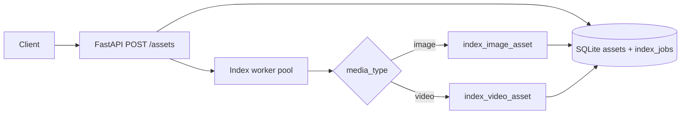
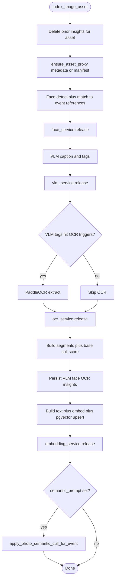
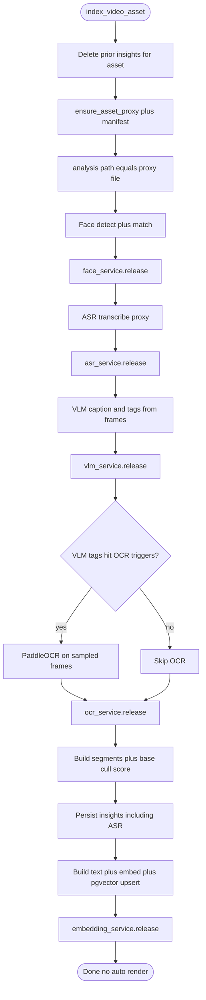
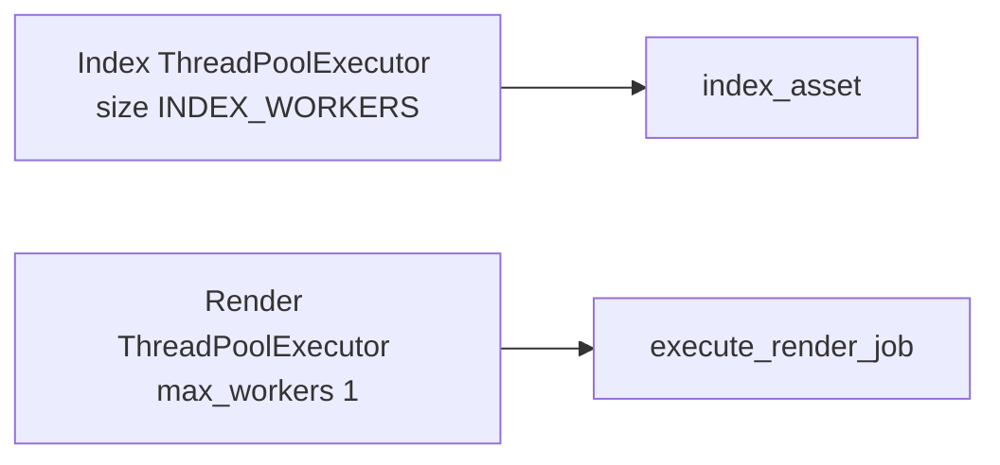

# Indexing pipeline (PoC)

This document describes how **image** and **video** assets are indexed in Videowala today. Implementation lives mainly in:

- [`backend/app/services/indexing.py`](../backend/app/services/indexing.py) — `index_image_asset`, `index_video_asset`, `index_asset` (dispatcher)
- [`backend/app/workers/index_worker.py`](../backend/app/workers/index_worker.py) — queued jobs, serial worker pool by default
- [`backend/app/config.py`](../backend/app/config.py) — `INDEX_WORKERS`, `IMAGE_INDEX_SEMANTIC_CULL_PERCENT`, model IDs

**Rendering** is **not** part of indexing. After video (or any) assets are indexed, users trigger renders via the existing render APIs (see [`docs/api.md`](api.md)).

---

## End-to-end: ingest to persisted insights

Indexing runs **after** `POST /assets` registers an asset. The API creates an **`index_jobs`** row and returns quickly; a background worker runs the appropriate pipeline.

- **`INDEX_WORKERS`** defaults to **`1`**: at most one index job runs at a time (PoC: avoid overlapping GPU-heavy work across assets).
- Each pipeline stage uses **one model family at a time**, then calls **`release()`** on that service so weights can leave GPU memory before the next stage loads.

---

## Image pipeline

Analysis uses the **original file path** (no video proxy). Stages run in order; after each heavy stage the corresponding service **`release()`** runs (InsightFace stub/real, VLM, PaddleOCR, sentence-transformers).

**Semantic prompt (optional):** if ingest included **`semantic_prompt`**, after embeddings exist the event’s **image** segments are re-scored with the same logic as photo curation (blend base score with semantic search), using **`IMAGE_INDEX_SEMANTIC_CULL_PERCENT`**. Query-time curation via the photo API still works when no ingest prompt is used.

---

## Video pipeline

Analysis uses the **proxy MP4** when available (see `ensure_asset_proxy`). Order: faces → **ASR** (Whisper on extracted audio) → VLM (multi-frame) → gated OCR → embedding. Each stage ends with **`release()`** on the service that held the model for that stage.

**Rendering:** indexing only writes insights, segments, and vectors. The user (or UI) calls the **render** endpoints separately when a video output is needed.

---

## Worker versus render pool

Index jobs and render jobs use **different** thread pools so a long index queue does not block **`submit_render_job`**.

---

## Configuration knobs (summary)

| Setting | Role |
| ------- | ---- |
| `INDEX_WORKERS` | Parallelism of **index jobs** across assets (default `1`). |
| `INDEXING_PROGRESS` | tqdm on **batch** folder ingest file list (stderr TTY behavior). |
| `IMAGE_INDEX_SEMANTIC_CULL_PERCENT` | Keep fraction when **`semantic_prompt`** is used at image ingest. |
| `OCR_TRIGGER_TAGS` | VLM tags that **enable** OCR after captioning. |
| `VLM_MODEL_ID`, `EMBEDDING_MODEL_ID`, etc. | Model selection (see [`docs/running.md`](running.md)). |

For PoC defaults and AI behavior expectations, see [`.cursor/rules/poc-first.mdc`](../.cursor/rules/poc-first.mdc).
