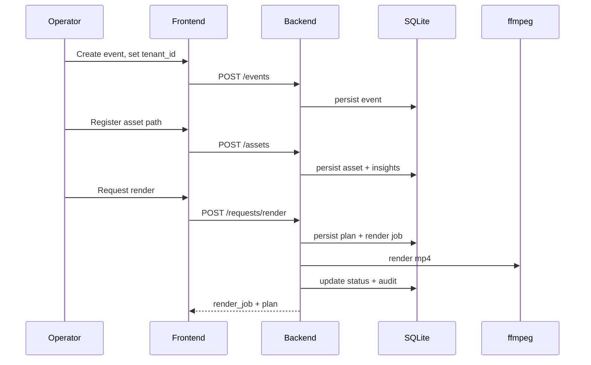

# Feasibility

**Product goals and value proposition:** see the root [`README.md`](../../README.md). Below: what the repo proves today, then feasibility angles that are not repeated there.

## Implementation status

The repo already demonstrates a narrow “feasible v1” loop:

- Event + asset registration (assets are **paths on disk**, not uploaded bytes yet)
- Synchronous indexing that persists insights (SQLite)
- Deterministic planner schema + plan persistence
- Deterministic ffmpeg render producing an `.mp4`
- Include/exclude regenerate loop + audit logging

## Short answer

Feasible if the promise stays **first-cut + human review**, not full autonomous cinema. The root README states that positioning; this repo’s synchronous MVP exercises the loop end-to-end (stub/real models configurable). Smaller VLMs (e.g. SmolVLM2) reduce pilot GPU cost versus larger families.

## What Is Feasible Now

These capabilities are practical with a self-hosted stack:

- ingest large batches of photos and videos
- extract technical metadata with `ffprobe`
- generate thumbnails and low-resolution proxy videos
- sample video frames for analysis rather than processing every frame
- caption images and sampled video clips with an open VLM
- generate semantic embeddings for search and retrieval
- cluster or identify faces within a tenant-scoped event library
- run OCR on signs, displays, and text-heavy frames
- transcribe spoken audio from videos
- rank candidate shots based on rules and model-derived signals
- render previews and final outputs with `ffmpeg`

## What Is Feasible With Heuristics

These are achievable, but quality will depend on product design and review loops:

- identifying "best moments" from weddings, birthdays, and performances
- generating person-focused reels
- making chronological highlight films feel coherent
- choosing enough media variety to avoid repetitive edits
- creating good first-cut timelines from a text brief

The system should present these as AI-assisted decisions, not infallible truth.

## What Should Not Be A V1 Promise

- fully autonomous cinematic storytelling
- deep emotional narrative understanding
- guaranteed perfect person identification in all lighting conditions
- real-time indexing of large multi-camera events on modest hardware
- one-model-does-everything simplicity

## Why The Architecture Is Feasible

The key design choice is compositionality. Instead of depending on a single giant model to do all tasks, the platform can combine:

- a multimodal model for image and video understanding
- an embedding model for retrieval
- face recognition tools
- OCR tools
- speech-to-text tools
- deterministic render tooling

This reduces both model risk and infrastructure complexity.

## Main Technical Constraint

Video indexing is the expensive part.

The most important feasibility insight is that full-resolution, frame-by-frame reasoning is unnecessary for most use cases. The practical path is:

1. create proxy videos
2. detect coarse scenes or shot boundaries
3. sample frames or short clips
4. run multimodal inference on those samples
5. store structured insights and embeddings
6. use the structured results to build edit plans

## Product Constraint

Edit taste is a harder problem than media understanding.

A strong v1 should optimize for:

- good shot selection
- good person and moment retrieval
- good first-cut assembly
- easy human override

Instead of optimizing for:

- fully replacing experienced editors

## Feasibility Conclusion

This product is technically feasible as a privacy-first SaaS if:

- tenant isolation is built in from day one
- video analysis is sample-based rather than exhaustive
- the MVP is positioned as first-cut generation, not final artistic replacement
- the first workflow is narrow and repeatable

## Privacy

Same as root README: self-hosted / open-weight only, no third-party model APIs. Implementation adds tenant-scoped APIs and audit logs in SQLite; deletion hardening remains a product milestone.
