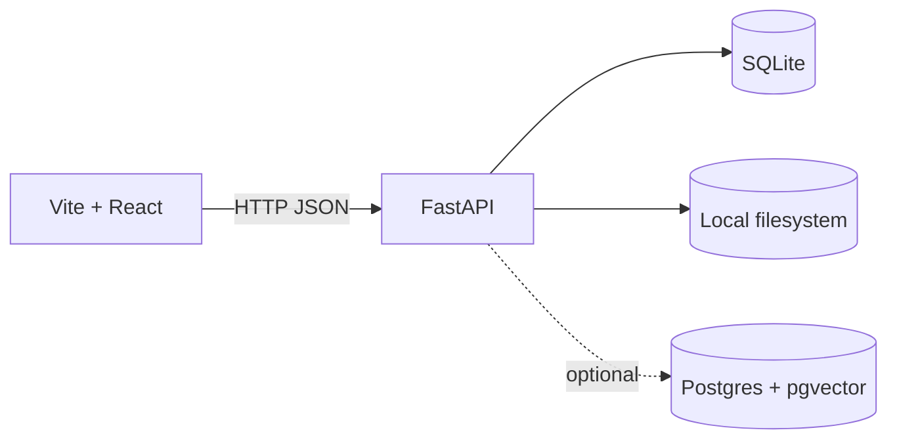

# Tech Stack

## Implementation status

This page started as a **recommended pitch stack**. The repo has since implemented a smaller “stage 1” stack for speed:

- **Backend**: Python + FastAPI (implemented)
- **Persistence**: SQLite (implemented; auto-migrated on startup)
- **Frontend**: Vite + React (implemented)
- **Background jobs**: none yet (index/render run synchronously in-process today)
- **Vector retrieval**: optional Postgres + pgvector when `stage2_semantic_enabled` is enabled (implemented as a best-effort hook)
- **Object storage**: not yet (assets are referenced by filesystem path; renders go to `storage/...`)

## Recommended MVP Stack

### Backend

- Python `FastAPI`

Why:

- good fit for API plus pipeline orchestration
- strong ecosystem for ML and media tooling
- easy integration with worker processes and model-serving code

### Background Jobs

- `Redis` plus `Dramatiq` or `RQ`

Why:

- long-running indexing and render jobs should be asynchronous
- operationally simpler than overbuilding around a heavier workflow engine too early

### Database

- `PostgreSQL`

Why:

- good fit for tenants, events, jobs, metadata, and audit trails
- strong filtering capabilities for event workflows

### Vector Retrieval

- `pgvector`

Why:

- avoids introducing a second data service too early
- likely sufficient for MVP and pilot scale
- keeps structured metadata and embeddings close together

Use `Qdrant` later only if scale or retrieval latency justifies it.

### Object Storage

- `MinIO` or another S3-compatible store

Why:

- clean separation between metadata and binary media
- supports originals, thumbnails, proxies, and renders

### Media Tooling

- `ffmpeg`
- `ffprobe`
- `PySceneDetect`
- `transformers`
- `decord`

Why:

- `ffmpeg` is the deterministic assembly engine
- `ffprobe` handles reliable media inspection
- `PySceneDetect` can improve segment-level video analysis and planning
- `transformers` gives a direct path to self-hosting `SmolVLM2`
- `decord` is useful for practical local video loading during inference

### Frontend

- `Next.js` (recommended for a full product surface)

Note: the repo currently uses **Vite + React** for a minimal operator UI.

Why:

- practical for internal tools and a private web product
- fast iteration for upload, review, and request flows

## Why This Stack

The main stack should reduce risk, not maximize novelty.

- Python is already where most model integration work will happen
- `pgvector` is simpler than launching a dedicated vector database at day one
- `ffmpeg` is battle-tested and aligns with the product promise of deterministic edits
- `Next.js` is sufficient for the first operator-facing product surface

## Non-Goals For The MVP Stack

- no workflow engine overkill unless job complexity truly demands it
- no separate vector service unless scale clearly requires it
- no mobile app-first architecture
- no dependency on third-party hosted model APIs

## Suggested Service Split

- API service
- indexing worker
- rendering worker
- model-serving process or GPU worker
- PostgreSQL
- Redis
- object storage

## Privacy Posture

- all core services are intended to be self-hosted or run on infrastructure we control
- media is never sent to third-party model APIs
- audit and deletion requirements should be part of the stack design from the start
